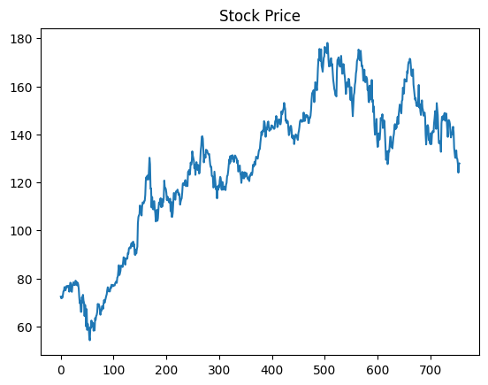
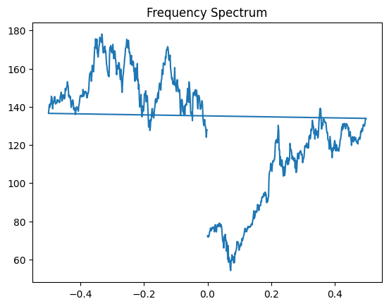
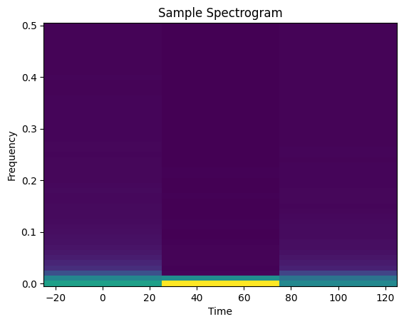
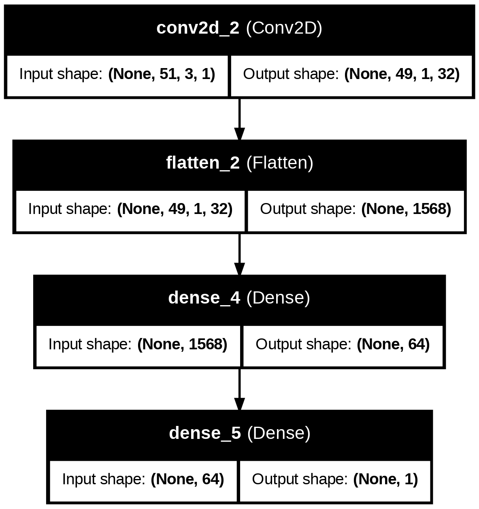

# Stock Market Prediction using STFT and CNN

## 👤 Student Details
- Name: SOORAJ K R
- Registration Number: TCR24CS065

## 📌 Project Overview
This project aims to predict stock market prices using signal processing and deep learning techniques.

## 🔧 Methodology
1. Collected historical stock data using Yahoo Finance API  
2. Converted time-series data into signal format  
3. Applied Short-Time Fourier Transform (STFT)  
4. Generated spectrograms (time-frequency representation)  
5. Used Convolutional Neural Network (CNN) to learn patterns  
6. Predicted future stock prices  

## 🧠 Model Details
- Input: Spectrogram images  
- Model: CNN (Convolutional Neural Network)  
- Output: Predicted next stock price  

## 📊 Technologies Used
- Python  
- NumPy  
- Pandas  
- Matplotlib  
- SciPy  
- TensorFlow / Keras  

## 📁 Files in Repository
- `app.ipynb` → Main implementation in Google Colab  
- `app.py` → Python script version  
- `requirements.txt` → Required libraries
- `photos` → Diagrams

## 📈 Project Visualizations

### 1. Time Series Plot

### 2. Frequency Spectrum

### 3. Spectrogram

### 4. CNN Architecture

## 🚀 Results
The model successfully learns patterns from stock data and predicts future prices based on time-frequency analysis.

## 🔗 Data Source
- Yahoo Finance (yfinance API)
